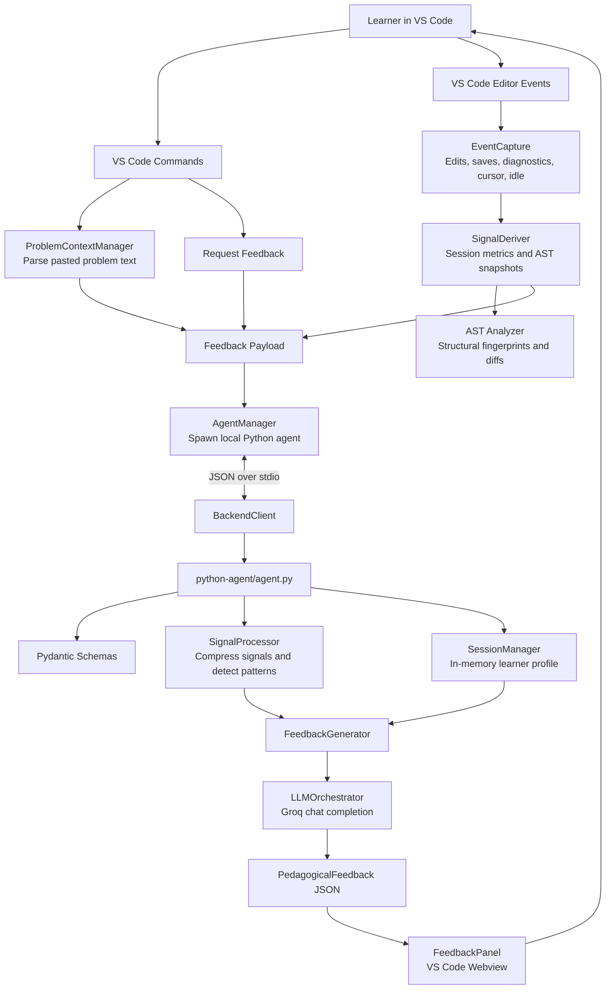
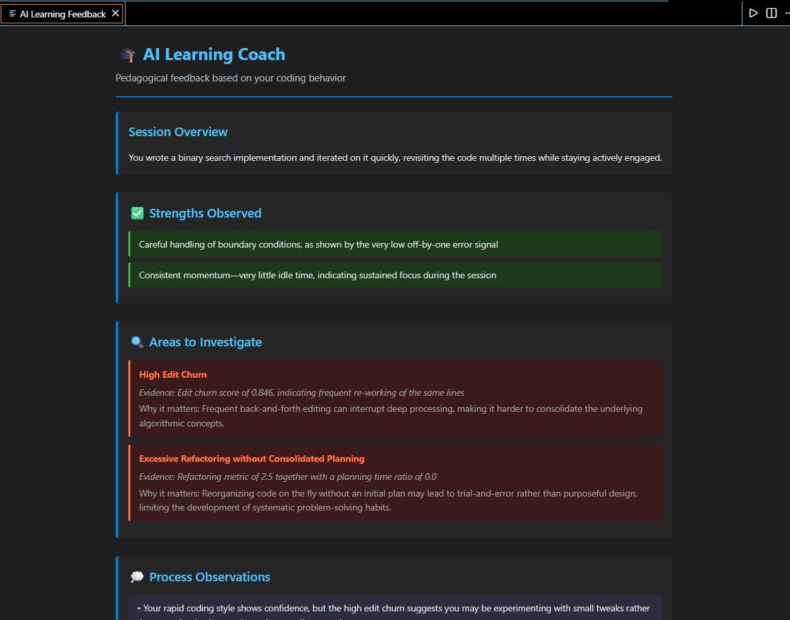

# AI Learning Coach

AI Learning Coach is a VS Code extension for DSA and competitive programming learners. Instead of acting like a solution generator, it observes how a learner approaches a problem, derives behavioral and structural signals from the coding session, and returns reflective feedback about problem-solving process, debugging habits, and conceptual blind spots.

The project is aimed at learners practicing on platforms such as LeetCode, Codeforces, and similar interview-prep environments. Its core idea is simple: correctness matters, but the path a learner takes while reaching or missing correctness is often the better teaching signal.

## Table of Contents

- [Why This Exists](#why-this-exists)
- [What It Does](#what-it-does)
- [Features](#features)
- [How It Works](#how-it-works)
- [Architecture](#architecture)
- [Repository Structure](#repository-structure)
- [System Design Concepts](#system-design-concepts)
- [Current Scope and Limitations](#current-scope-and-limitations)
- [Setup Guide](#setup-guide)
- [Commands](#commands)
- [Troubleshooting](#troubleshooting)
- [Project Philosophy](#project-philosophy)
- [License](#license)

## Why This Exists

Most coding assistants focus on the final answer:

- Did the code pass?
- What hint should come next?
- What is the optimal solution?

AI Learning Coach focuses on the learning process:

- Did the learner jump into coding without planning?
- Are boundary mistakes recurring?
- Is the solution being rewritten repeatedly in the same area?
- Did the learner abandon an approach after a pause?
- Are structural changes suggesting uncertainty about loops, conditionals, or decomposition?

The extension is designed to answer a different question:

> How am I thinking while I code?

## What It Does

AI Learning Coach runs inside VS Code and silently captures lightweight coding-session events. When the learner requests feedback, the extension sends a structured snapshot to a local Python agent. The agent compresses the session into interpretable learning signals, asks an LLM for schema-constrained pedagogical feedback, and renders the result in a VS Code webview.

The feedback is intentionally reflective. It does not provide full solutions, code fixes, or direct algorithm implementations. It gives evidence-backed observations, learning suggestions, and reflection questions.

## Features

- Problem context capture from the clipboard for pasted LeetCode, Codeforces, or plain-text problem statements.
- Session event tracking for edits, saves, diagnostics, cursor movement, idle time, and undo/redo-like behavior.
- Derived learning signals such as edit churn, planning time ratio, boundary error density, abandoned attempts, refactor frequency, and cursor jump count.
- AST fingerprinting on save for structural-change detection in JavaScript/TypeScript-oriented analysis.
- Local Python agent launched by the extension and connected through JSON-over-stdio.
- Groq-backed LLM orchestration with a strict feedback schema.
- In-memory learner profile and historical context during the agent process lifetime.
- VS Code webview panel for structured feedback.
- Commands for pasting problem context, requesting feedback, resetting the session, and reviewing the current problem context.

## How It Works

1. The learner copies a DSA problem statement and runs `AI Coach: Paste Problem Context`.
2. The extension parses useful context such as title, difficulty, tags, constraints, examples, source, and expected complexity when present.
3. The learner codes normally in VS Code.
4. The TypeScript extension layer records editor events and diagnostics.
5. On save, the signal layer records an AST fingerprint for supported structural analysis.
6. The learner runs `AI Coach: Request Feedback`.
7. The extension sends problem context, session signals, and a code snapshot to the embedded Python agent over stdio.
8. The Python agent validates the request, compresses signals, detects high-level patterns, adds in-memory historical context, and calls the LLM.
9. The LLM returns JSON matching the pedagogical feedback schema.
10. The extension renders feedback in a VS Code webview.

## Architecture



### Runtime Layers

| Layer | Main Files | Responsibility |
| --- | --- | --- |
| VS Code activation and commands | `src/extension.ts` | Initializes managers and registers user commands. |
| Event capture | `src/eventCapture.ts` | Listens to editor changes, saves, diagnostics, selections, and idle intervals. |
| Signal derivation | `src/signalDeriver.ts` | Converts raw events into learning-oriented metrics. |
| AST analysis | `src/ast/*` | Generates structural fingerprints, diffs snapshots, and classifies refactors. |
| Agent bridge | `src/agentManager.ts`, `src/backend.ts` | Starts the Python process and exchanges line-delimited JSON over stdio. |
| Python agent | `python-agent/agent.py` | Routes health and feedback requests. |
| Feedback backend | `python-agent/backend/*` | Validates schemas, compresses signals, manages session memory, calls the LLM, and returns feedback. |
| UI | `src/ui/feedbackPanel.ts` | Renders structured feedback in a VS Code webview. |

## Repository Structure

```text
.
|-- package.json                 # VS Code extension metadata, commands, scripts, and dependencies
|-- tsconfig.json                # TypeScript compiler configuration
|-- src/
|   |-- extension.ts             # Extension activation and command registration
|   |-- eventCapture.ts          # VS Code event listeners
|   |-- signalDeriver.ts         # Behavioral and structural signal calculation
|   |-- problemContext.ts        # Problem statement parsing
|   |-- agentManager.ts          # Python agent lifecycle
|   |-- backend.ts               # JSON-over-stdio client
|   |-- ast/                     # AST fingerprints, diffs, snapshots, and tests
|   `-- ui/feedbackPanel.ts      # Feedback webview
|-- python-agent/
|   |-- agent.py                 # Embedded stdio agent entrypoint
|   |-- requirements.txt         # Python dependencies
|   `-- backend/
|       |-- app.py               # Optional FastAPI service entrypoint
|       |-- schemas.py           # Pydantic request/response models
|       |-- signal_processor.py  # Signal compression and pattern detection
|       |-- session_manager.py   # In-memory learner/session profile
|       |-- llm_orchestrator.py  # Groq LLM prompt and response parsing
|       `-- feedback_generator.py
|-- ss.png                       # Feedback screenshot
|-- usage.png                    # Command usage screenshot
`-- LICENSE
```

## System Design Concepts

### Event-Driven Observation

The extension uses VS Code events instead of requiring a custom editor. This keeps the learner inside their normal workflow while still capturing useful process signals such as edit bursts, pauses, saves, diagnostics, and cursor movement.

### Signal Compression

Raw editor logs are noisy and not ideal LLM input. The TypeScript layer reduces them to compact metrics, and the Python `SignalProcessor` groups those metrics into higher-level categories such as code construction, error patterns, working style, and activity summary.

### Structural Change Detection

On save, the extension records AST fingerprints and compares them with previous snapshots. Large structural diffs are classified as refactor-like events, such as function extraction, loop restructuring, or conditional restructuring. This lets the coach reason about solution evolution rather than only final code.

### Local Agent Boundary

The VS Code extension does not directly call the LLM. It launches a Python agent and communicates through line-delimited JSON over stdio. This separates editor concerns from feedback generation and makes the backend easier to test, replace, or run as a service later.

### Schema-Constrained LLM Output

The Python backend expects feedback to match a Pydantic schema:

- `session_summary`
- `observed_strengths`
- `observed_issues`
- `process_feedback`
- `learning_suggestions`
- `reflection_questions`

This gives the UI a predictable shape and reduces the chance of unstructured assistant output leaking into the webview.

### Pedagogical Guardrails

The LLM prompt explicitly asks for process feedback, not code corrections. The intended output is evidence-based coaching: what behavior was observed, why it matters for learning, and what the learner should reflect on next.

### Session Memory

The Python `SessionManager` keeps learner profiles and session history in memory while the agent process is alive. This allows repeated gaps and antipatterns to influence feedback during the current runtime without introducing database or account infrastructure.

### Graceful Failure

If LLM output cannot be parsed or the LLM request fails, the backend returns fallback pedagogical feedback instead of crashing the extension command.

## Current Scope and Limitations

- The extension is optimized for a local embedded Python agent.
- `python-agent/backend/app.py` provides an optional FastAPI service entrypoint, but the VS Code extension path currently uses stdio.
- The extension currently looks for the virtual environment Python executable at `.extension-agent/Scripts/python.exe`, which matches Windows development environments.
- AST fingerprinting is implemented with the TypeScript compiler API and is most reliable for JavaScript and TypeScript style syntax.
- Python files still participate in edit, save, diagnostic, idle, and feedback flows, but structural AST analysis should be treated as heuristic unless expanded with a Python parser.
- Learner history is in memory and resets when the Python agent process restarts.
- Feedback requests send a code snapshot and derived session signals to the configured Groq LLM provider.

## Setup Guide

There are two practical ways to use the project: install a packaged VSIX as a user, or run the extension from source as a contributor.

### Option 1: Install From VSIX

Use this path if you only want to try the extension.

1. Download the latest `.vsix` package from the project releases.
2. Open VS Code.
3. Open the Command Palette with `Ctrl+Shift+P`.
4. Run `Extensions: Install from VSIX`.
5. Select the downloaded `.vsix` file.
6. Reload VS Code.
7. Ensure Python 3.9 or newer is installed.
8. Configure your Groq API key in the extension settings or in a local `.env` file:

```env
GROQ_API_KEY=your_groq_api_key
```

### Option 2: Development Mode

Use this path if you want to modify or study the internals.

#### 1. Clone the Repository

```bash
git clone https://github.com/JustATalentedGuy/AIIDE.git
cd AIIDE/vscode-extension
```

If your checkout already points directly at the extension folder, open that folder instead.

#### 2. Install Node Dependencies

```bash
npm install
```

#### 3. Create the Python Virtual Environment

The current extension manager expects the virtual environment to be named `.extension-agent`.

```bash
python -m venv .extension-agent
```

Activate it on Windows PowerShell:

```powershell
.\.extension-agent\Scripts\Activate.ps1
```

Install Python dependencies:

```bash
pip install -r python-agent/requirements.txt
```

#### 4. Configure Environment Variables

Create `.env` in the extension root:

```env
GROQ_API_KEY=your_groq_api_key
```

#### 5. Compile the Extension

```bash
npm run compile
```

#### 6. Launch in VS Code

1. Open the extension folder in VS Code.
2. Press `F5`.
3. VS Code will open an Extension Development Host.
4. Use the Command Palette inside that host to run the AI Coach commands.

## Commands

The extension contributes these commands:

| Command | Purpose |
| --- | --- |
| `AI Coach: Paste Problem Context` | Reads the clipboard and parses the current problem statement. |
| `AI Coach: Request Feedback` | Sends the current session signals and code snapshot to the Python agent. |
| `AI Coach: Reset Session` | Clears the current signal session and problem context. |
| `AI Coach: Show Problem Context` | Opens the parsed problem context in a temporary Markdown document. |

`AI Coach: Request Feedback` is also bound to:

- Windows/Linux: `Ctrl+Shift+A`
- macOS: `Cmd+Shift+A`

## Screenshots




## Troubleshooting

### Extension Fails to Activate

- Confirm that `.extension-agent` exists in the extension root.
- Confirm that `.extension-agent/Scripts/python.exe` exists on Windows.
- Run `npm run compile` and check for TypeScript errors.
- Check the VS Code Developer Tools console for agent startup errors.

### Agent Fails to Start

- Activate the virtual environment and run `pip install -r python-agent/requirements.txt`.
- Confirm that `GROQ_API_KEY` is available in `.env` or extension settings.
- Confirm that Python 3.9 or newer is installed.

### Feedback Request Fails

- Verify the Groq API key.
- Check network access to the LLM provider.
- Check the Python agent stderr output in the VS Code extension host logs.
- Try `AI Coach: Reset Session` and request feedback again.

### Feedback Looks Too Generic

- Paste the problem context before coding.
- Let the extension observe a meaningful coding session before requesting feedback.
- Save the file at least once so structural snapshots can be recorded.

## Project Philosophy

- Learning is temporal. A final code snapshot does not tell the whole story.
- IDEs are rich learning sensors when signals are compressed responsibly.
- LLMs work better with structured context than with raw event logs.
- Good coaching should make learners more aware of their thinking, not more dependent on hints.
- The goal is concept repair and self-diagnosis, not answer delivery.

## License

This project is licensed under the MIT License. See [LICENSE](LICENSE) for details.
