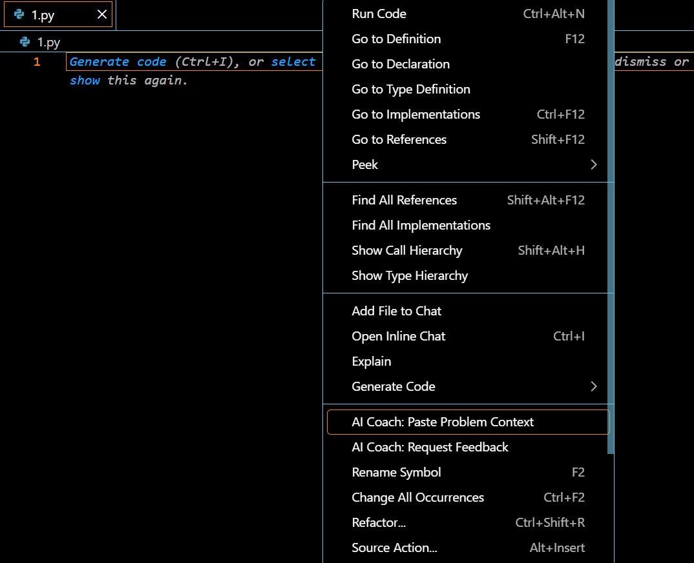

# 🧠 AI-IDE

> **An AI-augmented VS Code extension that observes *how* you code and gives pedagogical feedback — not solutions.**

This project is designed for **DSA / Competitive Programming learners** (LeetCode, Codeforces, etc.) who want to improve *thinking*, *problem-solving habits*, and *conceptual clarity*, not just pass test cases.

---

## ✨ What Makes This Different?

Most tools:

* Check correctness
* Give hints or full solutions
* Ignore the coding process

**AI Learning Coach IDE** instead:

* Observes **micro-interactions** while you code (edits, rewrites, pauses)
* Analyzes **temporal behavior** (planning vs execution, churn)
* Uses **AST-level signals** to detect conceptual mistakes
* Produces **structured pedagogical feedback**, not answers

> 💡 It answers *“How am I thinking?”*, not *“What is the answer?”*

---

## 🧱 High-Level Architecture

```
┌──────────────────────────────────────────────────────────────┐
│ 🎮 Layer 1: VS Code Events (TypeScript)                        │
│ eventCapture.ts • signalDeriver.ts                            │
└──────────────────────────────────────────────────────────────┘
                          ↓ JSON
┌──────────────────────────────────────────────────────────────┐
│ 🐍 Layer 2: Embedded Python Agent                              │
│ agent.py + backend/ (signals → patterns → LLM)                │
└──────────────────────────────────────────────────────────────┘
                          ↓ JSON
┌──────────────────────────────────────────────────────────────┐
│ 🖥️ Layer 3: IPC Bridge (stdio)                                 │
│ agentManager.ts • backend.ts                                  │
└──────────────────────────────────────────────────────────────┘
                          ↓
┌──────────────────────────────────────────────────────────────┐
│ 📱 Layer 4: Feedback UI (Webview)                              │
│ ui/feedbackPanel.ts                                           │
└──────────────────────────────────────────────────────────────┘
```

---

## 🔍 What the IDE Observes

### 1️⃣ Behavioral Signals

* Edit churn (insertions vs deletions)
* Undo / redo density
* Save frequency
* Idle vs active time (planning ratio)
* Cursor jumps (mental backtracking)
* Abandoned approaches

### 2️⃣ AST-Derived Signals

* Off-by-one boundary patterns
* Suspicious comparisons
* Repeated data-structure rewrites
* Inefficient iteration idioms

### 3️⃣ Temporal Learning Signals

* Repeated mistakes across sessions
* Persistent misconceptions
* Improvement / regression trends

---

## 🎓 Feedback Output

Feedback is **structured**, **reflective**, and **evidence-based**:

* **Observed Strengths**
* **Areas to Investigate** (with behavioral evidence)
* **Why It Matters** (DSA relevance)
* **Reflective Questions** (no hints, no solutions)

> ❌ No solutions
> ❌ No test case spoilers
> ✅ Pure learning feedback


---

## 🚀 End-to-End Flow

1. Paste a problem (LeetCode / Codeforces)
2. Code naturally (events captured silently)
3. Trigger **“AI Learning IDE: Request Feedback”**
4. Embedded Python agent analyzes behavior + AST
5. LLM generates pedagogical feedback
6. Webview renders insights

---

## 📦 Installation & Usage

There are **two supported ways** to use this extension.

---

## ✅ Option 1: Install via VSIX (Recommended for Users)

This is the **simplest way** to use the extension.

### Steps

1. Go to the **GitHub Releases** page
2. Download the latest `.vsix` file
3. Open VS Code
4. Press `Ctrl + Shift + P`
5. Select **Extensions: Install from VSIX**
6. Choose the downloaded file
7. Reload VS Code

### After Installation

* Ensure **Python 3.9+** is installed and available in PATH
* Create a `.env` file when prompted (or manually) with:

```
GROQ_API_KEY=your_groq_api_key
```

---

## 🧑‍💻 Option 2: Development / Contributor Mode

Use this if you want to **modify, extend, or study** the internals.

### 1️⃣ Clone the Repository

```bash
git clone https://github.com/JustATalentedGuy/AIIDE.git
cd AIIDE
```

### 2️⃣ Install Node Dependencies

```bash
npm install
```

### 3️⃣ Create Python Virtual Environment

```bash
python -m venv .extension-agent
```

Activate it:

**Windows (PowerShell)**

```bash
.\.extension-agent\Scripts\Activate.ps1
```

**macOS / Linux**

```bash
source .extension-agent/bin/activate
```

Install Python dependencies:

```bash
pip install groq pydantic python-dotenv fastapi uvicorn
```

### 4️⃣ Configure Environment Variables

Create `.env` in the project root:

```
GROQ_API_KEY=your_groq_api_key
```

### 5️⃣ Compile and Run

```bash
npm run compile
```

Open the folder in VS Code and press **F5** to launch the Extension Development Host.

---

## 🎮 Available Commands

Open Command Palette (`Ctrl + Shift + P`):

* **AI Learning IDE: Paste Problem**
* **AI Learning IDE: Request Feedback**
* **AI Learning IDE: Reset Session**
* **AI Learning IDE: Show Problem**


---

## 🛠️ Troubleshooting

**Extension does not start**

* Ensure Python is installed and discoverable
* Ensure `GROQ_API_KEY` is set

**LLM / API errors**

* Verify API key
* Check network connectivity

---

## 🎯 Project Philosophy

* IDEs are **event-driven systems**
* Learning is **temporal**, not snapshot-based
* LLMs need **structured context**, not raw logs
* Good feedback ≠ giving solutions

---

## 📜 License

MIT License

---

## 🙌 Final Note

If you are serious about improving at DSA:

> **This tool trains your thinking — not your memory.**

Happy learning 🚀